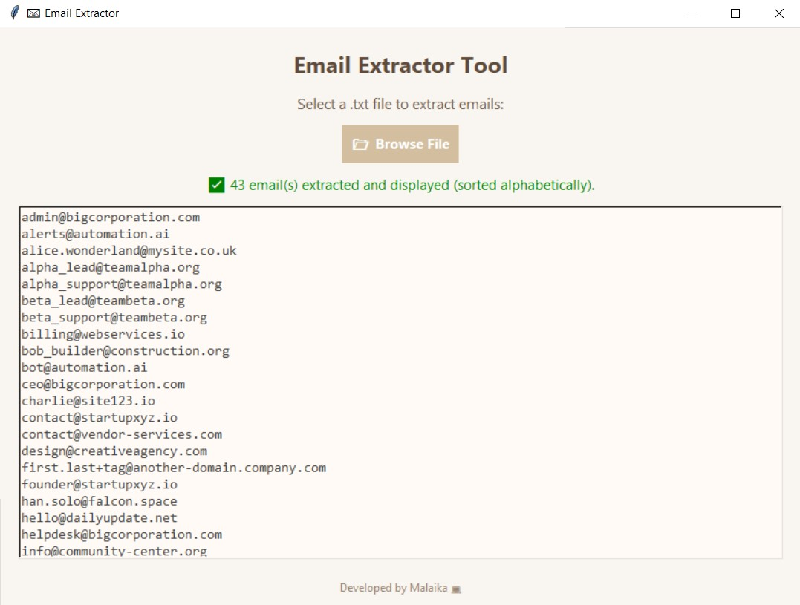

# GUI_Email-Extractor-from.txt
🧠 What It Does:
This project is a sleek and user-friendly Email Extractor tool built with Python's tkinter. It allows users to upload a .txt file, extract all valid email addresses, sort them alphabetically, and optionally save them to a new file — all within a beautiful pastel-themed GUI interface. 🌸

💡 Features:
✅ Select and read .txt files from your computer
✅ Extract all valid emails using regex
✅ Automatically sort emails A–Z 🔤
✅ Display extracted emails inside the app
✅ Option to save results to .txt file 💾
✅ Clean, minimal, pastel-themed interface 🎨
✅ Error handling and user feedback 🛡️

🖼️ GUI Highlights:
Soft nude/pastel colors for a calm user experience
Modern fonts (Segoe UI, Consolas) for readability
Clear buttons, labels, and status messages
Built-in file dialog for file selection and saving

🧪 Technologies Used:
🐍 Python 3
🖼️ tkinter for GUI
🔍 re (Regular Expressions) for email matching
📁 File handling (open, saveasfilename)

🛠️ Use Cases:
Digital marketing contact cleanup 📩
Academic research data extraction 🧑‍🏫
Admin or HR lists management 🧑‍💼
Freelancers handling form submissions 🧾

📝 How to Run:
Run email_extractor_gui.py
Click “📂 Browse File” and select a .txt file
View extracted emails in the window
Click save to export the list

👩‍💻 Created by: Malaika Fatima
“Even small utilities can look beautiful and be powerful!” ✨

